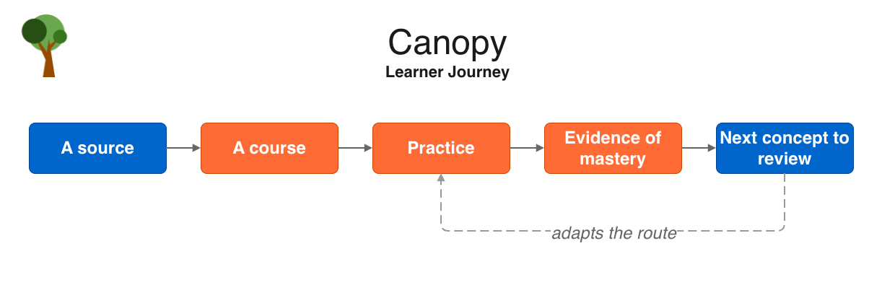
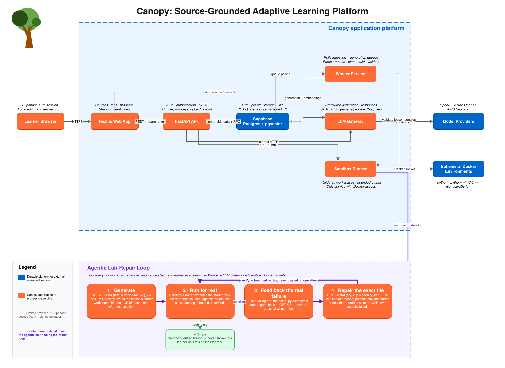

# Canopy

## Inspiration

Technical knowledge is everywhere — papers, docs, textbooks, internal engineering
notes — and AI can explain any of it on demand. But explanation was never the hard
part. The hard part is finding out, honestly, whether you can *do* the thing the
material describes. A chat window will happily walk you through the Transformer
architecture and leave you feeling like you understand it; it won't tell you that your
own implementation of scaled dot-product attention silently transposes two axes. That
gap — confident-sounding explanation standing in for verified capability — is where
real cost shows up: in an interview, in a code review, in production, at exactly the
moment it's most expensive to discover.

Codecademy proved people will work through structured, hands-on courses when the
content is curated for them. But curation doesn't scale to "the paper I'm actually
reading this week" or "our team's internal API docs." We wanted the Codecademy
experience — lessons, a real editor, checkpoint exercises — generated from *any*
source, on demand, and adaptive to what you've actually demonstrated instead of what
you've merely scrolled past. That's Canopy.

<!-- SCREENSHOT: hero shot of the app — the course dashboard or a lesson mid-lab, whichever reads best at a glance -->

*Space reserved: hero screenshot (course dashboard or an in-progress lab).*

## What it does

Canopy turns a source you provide — a paper, docs, a textbook chapter, your own pasted
notes — into a full, hands-on course: structured lessons cited back to the exact
passage they came from, coding labs, and quizzes, generated specifically for the goal
you state in your own words. It doesn't stop at telling you what you got wrong — it
takes action on it: it generates the lab, runs it, repairs it if it's broken, and the
moment you're struggling on a concept it identifies the exact shaky prerequisite behind
that struggle and routes you back to it, rather than just flagging a low score and
leaving you to figure out why.

*Source → course → practice → evidence of mastery → the next concept to review — the
loop Canopy runs, not a linear course you finish once.*

- **Source-grounded lessons.** Every claim can carry an inline citation that resolves
  to the real excerpt it came from — verifiable, not an opaque summary.
- **Real, sandbox-verified coding labs**, not toy exercises — three curated
  environments (Python, Python ML/DL with GPU-capable PyTorch/scikit-learn, and C++),
  auto-selected from your goal and source. Every lab is run against a real sandbox
  before a learner ever sees it.
- **A real mastery model, not a completion checkbox.** Two independent Bayesian
  Knowledge Tracing tracks per concept — understanding (from quizzes) and applying
  (from labs) — plus prerequisite-aware nudges: the moment you're struggling, Canopy
  identifies the shaky earlier concept it builds on and points you back to it.
- **A low-stakes practice pool** to drill a concept without it counting against you,
  an AI learning helper that hints without handing over the answer, a PDF coursebook
  and completion certificate to keep, and free one-click course sharing — anyone with
  the link gets their own independent copy at zero regeneration cost.

**What's actually different, and why it matters:** generic AI chat can explain a
concept but has no model of what you've demonstrated, so it can't tell you when you've
actually got it. Fixed-catalog platforms (Codecademy, Coursera) solve verification but
only for content someone already curated, so they can't touch your paper or your
team's docs. Canopy is the combination neither offers: generated from *your* material,
*and* held to the same verify-before-you-move-on standard as a hand-built course —
every lab sandbox-checked before it ships, every mastery signal earned from a real
graded observation, not a checkbox.

<!-- SCREENSHOT: the coding lab workspace — Monaco editor, Run/Submit, test results -->

*Space reserved: coding lab workspace (editor, Run/Submit, live test results).*

<!-- SCREENSHOT: mastery dashboard with the prerequisite-review nudge visible -->

*Space reserved: mastery dashboard showing per-concept understand/apply meters and a
prerequisite-review nudge in context.*

Full feature list: [`docs/product/FEATURES.md`](./product/FEATURES.md).

## How we built it

Five services: a **Next.js** web app, a **FastAPI** API, a standalone **worker**
that drains the generation queue, a provider-neutral **LLM gateway** microservice
(routes OpenAI, Azure OpenAI, and AWS Bedrock behind one interface, with per-task
model tiering — GPT-5.6's flagship "Sol" tier for one-shot, high-stakes calls like
course planning and lab repair, the faster "Luna" tier for the high-volume per-lesson
work), and a **sandbox runner** microservice — the only container with Docker socket
access — that executes every generated lab in a locked-down, single-use, no-network,
non-root container across six language environments. **Supabase** (Postgres +
pgvector + pgmq + Auth + Storage) is the data, queue, and auth layer underneath all of
it.

*The five-service runtime, including the agentic lab-repair loop in detail (Worker +
LLM Gateway + Sandbox Runner) — generate, run for real, feed back the actual failure,
repair, re-verify, bounded retries, never trusted on one attempt.*

**Built for real deployment, not just a demo run:** every generated lab executes in a
resource-limited, network-disabled, non-root, all-capabilities-dropped container, so
untrusted model-authored code can never touch the host or reach the network; every
learner-facing table is behind Postgres row-level security, and tables carrying answer
keys (`practice_items`, `lesson_revisions`) have no public policy at all — service-role
only; the LLM gateway abstracts three provider backends behind one interface, so a
provider outage or pricing change is a config change, not a rewrite; and dev-only
tooling (the demo auto-complete/clear commands used to drive a course to a finished
state for testing) is environment-gated and 404s outside local development rather than
merely being hidden in the UI.

### What GPT-5.6 actually does at runtime

It's not a bolt-on chat feature — it's the thing generating and grading the product's
actual content, every time:

- **Plans and writes every course.** Outline planning, per-module concept generation,
  and per-lesson content/lab authoring are all GPT-5.6 structured-output calls
  (`services/worker/`) — including inferring which coding-lab language (Python,
  Python ML/DL, or C++) fits a given source and goal, a decision the learner never
  makes by hand.
- **Generates and grades every assessment** — quiz items, the practice question pool,
  and rubric-based short-answer grading (`services/api/app/quiz.py`).
- **Drives the self-healing lab-repair loop.** When a generated lab's starter or
  reference solution fails its own sandbox run, GPT-5.6 gets the real pytest/doctest
  output back and repairs the specific files at fault, re-verified against the sandbox
  again before it ships — never trusted on a single attempt.
- **Powers the in-lesson learning helper**, prompted to guide toward an answer without
  ever handing it over.

### How Codex actually collaborated on the build

Used throughout as an active collaborator, not a one-off code generator:

- **Full-stack feature loops in one pass.** Non-trivial features — e.g. the practice
  question pool — went from a design doc through a Postgres migration, worker
  generation pass, API routes, and frontend UI in a single iterative session, with the
  decision log kept alongside the code as it was made
  (`docs/architecture/PRACTICE_QUESTION_POOL.md`).
- **Live debugging from real evidence, not guesses.** When a lab build failed in a
  running instance, Codex traced the failure from a live database row through the
  actual worker prompt and pytest traceback that caused it, rather than reasoning
  about it in the abstract — the fastest path we found working with Codex was always
  to hand it a concrete, reproducible failure to chase, not an abstract description of
  a bug.
- **Real product and design decisions, not just code**, made through this
  collaboration and recorded as they happened: making coding-lab language selection
  automatic (inferred by the planner) instead of a manual dropdown; the practice
  pool's mastery-effect design (positive-only credit, capped below the graded-mastery
  bar, so drilling can never hurt you); and the self-healing lab-repair loop's shape
  (generate → real sandbox run → feed back the actual failure → repair → re-verify)
  after an earlier version trusted a model's own claim of correctness too much.
- **Held to the same bar as the rest of the codebase.** Generated code went through
  the project's real test suites, not just visual review — `services/api/tests/`,
  `services/worker/tests/`, and `services/llm_gateway/tests/` gated every merge.

## Challenges we ran into

- **Isolation without giving up real test fidelity.** C labs need genuine memory-
  safety checking to teach manual memory management honestly, but our sandbox drops
  every Linux capability and runs as a non-root user — which breaks Valgrind, since
  it needs ptrace-style privileges we deliberately don't grant. We compiled with
  AddressSanitizer instead: compile-time instrumentation, verified to work under the
  exact hardening the sandbox already enforces.
- **Trusting generated code.** An LLM-authored lab is only as good as its own
  reference solution actually passing its own hidden tests. We built a real repair
  loop — generate, run in the actual sandbox, feed the real failure output back to the
  model, regenerate, re-verify — so a lab never reaches a learner on the strength of
  the model's first attempt or its own claim of correctness.
- **Making the prerequisite nudge fire on real evidence, not noise.** It only
  triggers when a learner is genuinely struggling on the current concept *and* a
  prerequisite it builds on has actually been practiced and is measurably shaky —
  getting that threshold right took real tuning against the BKT math, not a guess.
- **Being honest about our own mastery model.** We evaluated Canopy's design against
  the actual learning-science literature (`docs/product/PEDAGOGY_EVALUATION.md`) and
  found real gaps — a fixed "mastered" threshold and a fixed number of failed
  attempts before intervention, in a system where the assistance-dilemma and
  expertise-reversal research says the right amount of support should adapt to the
  learner, not be a constant.

## Accomplishments that we're proud of

Canopy is pre-launch, so we don't have real-user metrics yet — but every accomplishment
below is a concrete mechanism designed to produce a measurable outcome the moment it's
in front of learners, not a hoped-for one:

- A self-healing lab-generation loop that actually earns the word "agentic": generate,
  verify against a real sandbox, repair from the real failure, re-verify — no lab ships
  unverified. The direct, measurable consequence: zero unverified labs can reach a
  learner, by construction, not by review effort.
- A mastery model with teeth — dual-track BKT and prerequisite-aware review that
  responds to demonstrated evidence, not time spent clicking through pages. The
  measurable consequence: a learner (or a hiring manager looking at a certificate) gets
  a signal tied to graded evidence, not a completion percentage that only measures
  clicking through.
- Three real, curated, resource-tuned sandbox environments that the generation prompts
  know how to target correctly, instead of one generic Python box.
- Free, instant course cloning via a link — a genuine product answer to not having a
  team/org layer yet, that costs nothing per additional learner. The measurable
  consequence: sharing a course to ten more people costs the same as sharing it to one.
- The whole loop actually works end to end, live: source → generated course →
  sandbox-verified labs → mastery tracking → PDF certificate.

<!-- SCREENSHOT: the completion certificate (in-app dialog or exported PDF) -->

*Space reserved: completion certificate — in-app dialog or the exported PDF.*

## What we learned

Canopy's foundations — active learning, retrieval practice, worked examples,
immediate feedback, mastery framing — are strong by the actual research, and a few
choices (dual-track mastery, the self-validating sandbox, source grounding) are ahead
of typical edtech. But holding the product up against the literature surfaced the
same lesson twice: **trusting a generated artifact more than it's earned** —
an extracted concept graph treated as a validated progression, a green test suite
treated as a clean mastery signal — is where the real risk lives, and **fixed
constants where the evidence demands adaptivity** is where the clearest next wins are.
We also learned that Codex is most effective on a real, multi-service codebase when
you hand it a concrete, reproducible failure — a specific database row, a specific
pytest traceback — rather than an abstract instruction.

## What's next for Canopy

Canopy is built as a platform, not a single feature — every item below extends
infrastructure that's already shipped rather than starting from scratch:

- **Spaced re-retrieval of already-mastered concepts** — the highest-confidence
  pedagogy fix per our own evaluation, and it reuses the quiz engine already built.
- **An adaptive remediation trigger**, replacing the current fixed "N failed
  attempts" constant with something sensitive to the learner's actual level.
- **A real cohort/team layer** — a shared progress dashboard for a group, not just
  Google-Docs-style link sharing. The single biggest structural gap today, and the
  clearest path to broader (classroom, team, org) adoption.
- **Repository/codebase ingestion** — point a course at a GitHub repo instead of
  uploading files by hand.
- Multiple content languages, and a broader UI polish pass.

Full roadmap: [`docs/product/ROADMAP.md`](./product/ROADMAP.md).
